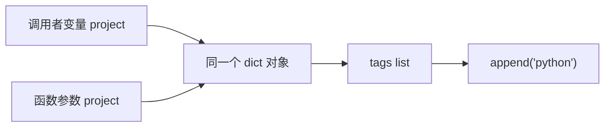

# M1-T02｜Python 对象引用与可变对象

这一节对应附件中的：

* `list / dict / set / tuple`
* 可变对象与不可变对象
* 对象引用
* 浅拷贝与深拷贝
* 参数传递

附件特别用 `a = {...}; b = a` 强调：**`a` 和 `b` 指向的是同一个对象，并不是两份数据。** 

---

## 1. 本节目标（对应附件中的验收标准）

完成这一卡以后，你必须能解释下面代码为什么会这样：

```python
project_a = {
    "name": "LLM Experiment",
    "tags": ["research"],
}

project_b = project_a

project_b["tags"].append("urgent")

print(project_a)
```

输出中的 `project_a` 也会出现：

```text
urgent
```

你还必须能独立判断这四种操作的区别：

```python
b = a
b = a.copy()
b = copy.deepcopy(a)
b = {"name": a["name"], "tags": list(a["tags"])}
```

本节最终目标不是背概念，而是防止以后出现这种真实后端 Bug：

```text
读取项目 A
↓
“复制”一份准备修改
↓
修改副本
↓
原项目 A 莫名其妙一起改变
```

---

# 2. 核心概念图解

## 2.1 最重要的一句话

Python 中：

```text
变量不是盒子。
变量更像对象的标签。
```

看：

```python
a = {"count": 1}
b = a
```

不要脑补成：

```text
a → {"count": 1}

b → {"count": 1}
```

两份对象。

真实模型更接近：

```text
             ┌────────────────┐
a ──────────►│ {"count": 1}   │
             │                │
b ──────────►│ 同一个 dict     │
             └────────────────┘
```

所以：

```python
b["count"] = 2
```

实际上是在修改那个**共享对象**：

```text
             ┌────────────────┐
a ──────────►│ {"count": 2}   │
             │                │
b ──────────►│ 同一个 dict     │
             └────────────────┘
```

于是：

```python
print(a["count"])
```

也是：

```text
2
```

---

## 2.2 `=` 默认不是复制

这是这一节第一条纪律：

```python
b = a
```

通常应该理解为：

> 让 `b` 也引用 `a` 当前引用的对象。

而不是：

> 克隆 `a`。

可以验证：

```python
a = {"count": 1}
b = a

print(a is b)
```

结果：

```text
True
```

`is` 比较的是：

> 是不是同一个对象。

而：

```python
==
```

通常关注的是：

> 值是否相等。

例如：

```python
a = {"count": 1}
b = {"count": 1}

print(a == b)
print(a is b)
```

结果通常是：

```text
True
False
```

也就是：

```text
内容相同
≠
同一个对象
```

---

## 2.3 可变对象与不可变对象

M1 阶段先记住最常见的。

### 常见可变对象

```text
list
dict
set
```

例如：

```python
tags = ["python"]

tags.append("backend")
```

原对象发生改变。

---

### 常见不可变对象

```text
int
float
bool
str
tuple
```

例如：

```python
name = "Workspace"
name = name + " Lite"
```

这不是把原字符串内部改掉。

更接近：

```text
旧字符串：
"Workspace"

↓

创建新字符串：
"Workspace Lite"

↓

让 name 改为引用新字符串
```

---

## 2.4 后端开发真正危险的是“嵌套可变对象”

例如：

```python
project = {
    "name": "AI Workspace",
    "tags": ["python", "backend"],
}
```

结构是：

```text
project
  │
  ▼
dict
├── "name" ──► str
│
└── "tags" ──► list
                ├── "python"
                └── "backend"
```

这里：

```text
dict 是可变的
list 也是可变的
```

这会直接引出浅拷贝问题。

---

## 2.5 浅拷贝：只复制第一层

看：

```python
original = {
    "name": "AI Workspace",
    "tags": ["python"],
}

copied = original.copy()
```

此时：

```python
original is copied
```

是：

```text
False
```

看起来复制成功了。

但是：

```python
original["tags"] is copied["tags"]
```

却是：

```text
True
```

结构实际上是：

```text
original ──► dict A
                │
                └── tags ───┐
                             │
                             ▼
                         list X

copied ────► dict B          ▲
                │            │
                └── tags ────┘
```

两个 `dict` 不一样。

但是里面的 `tags` 仍然是**同一个 list**。

所以：

```python
copied["tags"].append("urgent")
```

会导致：

```python
original["tags"]
```

一起发生变化。

这是非常经典的 Bug。

---

## 2.6 深拷贝

Python 提供：

```python
from copy import deepcopy
```

然后：

```python
copied = deepcopy(original)
```

概念上变成：

```text
original ──► dict A
                │
                ▼
             list X


copied ────► dict B
                │
                ▼
             list Y
```

于是：

```python
original["tags"] is copied["tags"]
```

是：

```text
False
```

但是不要形成一个坏习惯：

> “不知道引用关系怎么办？全部 `deepcopy()`。”

**不允许这么学。**

大型对象的深拷贝可能：

* 浪费内存；
* 增加运行时间；
* 复制本来应该共享的对象；
* 掩盖数据结构设计问题。

我们优先搞清楚：

> **到底哪部分数据需要独立。**

---

## 2.7 函数参数也遵循同样的规则

看：

```python
def add_tag(project, tag):
    project["tags"].append(tag)
```

调用：

```python
project = {
    "name": "AI Workspace",
    "tags": [],
}

add_tag(project, "python")
```

数据流：



函数并没有自动复制一份项目。

函数参数 `project` 也绑定到了同一个对象。

所以函数执行结束以后：

```python
print(project["tags"])
```

得到：

```text
["python"]
```

不要机械地说：

> “Python 是引用传递。”

更准确的理解是：

> **调用函数时，参数名称会绑定到传入的那个对象。**

目前理解到这里足够。

---

# 3. 最小可行性代码（Minimal Viable Code）

这一卡开始给 AI Workspace Lite 增加一点真正的领域数据行为。

但仍然**不引入 class / dataclass**。

它们属于 M1-T03 / T04。

目前先用 `dict`。

---

## 数据流先看清楚

我们要实现两种不同操作：

### 操作 A：明确修改原项目

```text
Project dict
↓
add_tag_in_place()
↓
修改原来的 tags
↓
调用者看到变化
```

### 操作 B：生成修改后的新项目

```text
Project dict
↓
with_tag()
↓
创建新的 dict
+
创建新的 tags list
↓
原项目保持不变
```

这两种都可以是正确设计。

真正危险的是：

> 函数名字看起来像“生成新数据”，实际上偷偷修改原对象。

---

## 新增 `/project/app/project_state.py`

```python
# 新增：app/project_state.py


def create_project(name):
    return {
        "name": name,
        "tags": [],
    }


def add_tag_in_place(project, tag):
    project["tags"].append(tag)


def with_tag(project, tag):
    return {
        **project,
        "tags": [*project["tags"], tag],
    }
```

现在逐个看。

---

### `create_project()`

```python
def create_project(name):
    return {
        "name": name,
        "tags": [],
    }
```

每调用一次：

```python
project_a = create_project("A")
project_b = create_project("B")
```

应该得到两个独立的 `tags` list。

也就是：

```text
project_a ─► dict A ─► list A

project_b ─► dict B ─► list B
```

而不能：

```text
project_a ─► dict A ─┐
                     ├──► 同一个 tags list
project_b ─► dict B ─┘
```

---

### `add_tag_in_place()`

```python
def add_tag_in_place(project, tag):
    project["tags"].append(tag)
```

这个函数的名字故意包含：

```text
in_place
```

告诉调用者：

> 我会修改你传进来的对象。

调用：

```python
project = create_project("Workspace")

add_tag_in_place(project, "python")
```

之后：

```python
project
```

已经改变。

这是**有意识的 mutation**。

它不一定是坏事。

---

### `with_tag()`

```python
def with_tag(project, tag):
    return {
        **project,
        "tags": [*project["tags"], tag],
    }
```

我们的目标则是：

```text
输入项目
↓
保持不变

返回项目
↓
拥有新增 tag
```

例如：

```python
original = create_project("Workspace")

updated = with_tag(original, "python")
```

应该满足：

```python
original["tags"] == []
updated["tags"] == ["python"]
```

而且：

```python
original is not updated
original["tags"] is not updated["tags"]
```

这才真正实现数据隔离。

---

## 新增测试

在现有测试之外新增：

```python
# 新增：tests/test_project_state.py

from app.project_state import (
    add_tag_in_place,
    create_project,
    with_tag,
)


def test_assignment_shares_same_project():
    project_a = create_project("Workspace")

    project_b = project_a
    project_b["name"] = "Changed"

    assert project_a["name"] == "Changed"
    assert project_a is project_b


def test_in_place_operation_changes_original_project():
    project = create_project("Workspace")

    add_tag_in_place(project, "python")

    assert project["tags"] == ["python"]


def test_with_tag_does_not_change_original_project():
    original = create_project("Workspace")

    updated = with_tag(original, "python")

    assert original["tags"] == []
    assert updated["tags"] == ["python"]

    assert original is not updated
    assert original["tags"] is not updated["tags"]


def test_projects_do_not_share_tag_lists():
    project_a = create_project("A")
    project_b = create_project("B")

    add_tag_in_place(project_a, "python")

    assert project_a["tags"] == ["python"]
    assert project_b["tags"] == []
```

运行：

```bash
pytest
```

你的原有：

```text
2 passed
```

现在至少应该增加这 4 个测试。

---

# 4. 项目集成指导（如何融入 AI Workspace Lite）

目前项目结构只增量增加：

```text
/project
├── app/
│   ├── __init__.py
│   ├── info.py
│   ├── main.py
│   ├── project_snapshot.py
│   └── project_state.py       # 新增
│
└── tests/
    ├── test_smoke.py
    └── test_project_state.py  # 新增
```

**不要修改 `main.py` 来演示这些函数。**

原因很简单：

`main.py` 是程序入口，不应该逐渐变成我们的课堂实验本。

我们已经开始建立第一个边界：

```text
main.py
→ 程序入口

project_state.py
→ Project 数据行为
```

现在它还非常粗糙。

后面你会看到它演进为：

```text
dict
↓
dataclass / model
↓
Service
↓
Repository
↓
数据库 ORM
```

但我们一次只跨一步。

---

# 5. 避坑指南

## 坑 1：以为 `b = a` 是复制

错误认知：

```python
backup = project
```

然后：

```python
project["name"] = "Changed"
```

你以为：

```text
backup
```

还是旧版本。

不是。

如果：

```python
backup is project
```

为：

```text
True
```

那它根本不是备份。

---

## 坑 2：以为 `dict.copy()` 能彻底隔离数据

例如：

```python
original = {
    "name": "Workspace",
    "tags": ["python"],
}

backup = original.copy()
```

然后：

```python
backup["tags"].append("ai")
```

原来的：

```python
original["tags"]
```

也会改变。

因为：

```text
dict 第一层复制了
tags list 没复制
```

---

## 坑 3：误认为函数不会修改外部变量

例如：

```python
def clear_tags(project):
    project["tags"].clear()
```

调用以后：

```python
clear_tags(project)
```

外面的 `project` 也被修改。

问题不在函数“越权”。

问题在于：

> 函数和调用者共享那个可变对象。

---

## 坑 4：最危险的可变默认参数

以后你很容易写出：

```python
def create_project(name, tags=[]):
    return {
        "name": name,
        "tags": tags,
    }
```

**不要这样写。**

因为这个 `[]` 不会在每次调用时都自动重新创建。

可能导致：

```text
Project A
      │
      ▼
共享 tags list
      ▲
      │
Project B
```

正确方式目前先记住：

```python
def create_project(name, tags=None):
    if tags is None:
        tags = []

    return {
        "name": name,
        "tags": tags,
    }
```

我们后面讲函数时还会回来检查这个问题。

---

## 坑 5：以为 tuple 内部一定完全不可变

例如：

```python
data = (
    "Workspace",
    ["python"],
)
```

虽然：

```text
tuple 本身不能把第2个位置替换掉
```

但：

```python
data[1].append("backend")
```

完全可能成功。

因为：

```text
tuple
↓
不能修改自己保存的引用

但引用指向的 list
↓
仍然是可变对象
```

这是理解“对象”和“引用”的很好测试。

---

## 坑 6：为了避免所有 mutation 就疯狂 `deepcopy`

这同样不是成熟设计。

真正应该问：

```text
这个函数的职责是什么？

它应该：
A. 修改现有对象？

还是：
B. 创建一个新的结果？
```

然后把行为设计清楚。

比如：

```python
add_tag_in_place(...)
```

明确是 A。

```python
with_tag(...)
```

明确是 B。

**清晰的函数契约，比到处 `deepcopy()` 更重要。**

---

# 6. 🚨 独立验收任务（无 AI 辅助，请关闭对话框完成）

这次验收重点不是“代码能跑”。

我要检查你是否真的理解对象关系。

---

## Task A：完成上述代码并运行测试

独立新增：

```text
app/project_state.py
tests/test_project_state.py
```

确保：

```bash
pytest
```

全部通过。

---

## Task B：独立增加 `members`

现在不要问我代码。

把 Project 扩展为：

```python
{
    "name": "...",
    "tags": [],
    "members": [],
}
```

然后保证：

```python
project_a = create_project("A")
project_b = create_project("B")
```

满足：

```python
project_a["members"] is not project_b["members"]
```

你必须自己新增对应测试。

---

## Task C：制造一个浅拷贝 Bug

自己写一个测试，构造：

```python
original
```

里面包含：

```text
members list
```

然后：

```python
copied = original.copy()
```

修改：

```python
copied["members"]
```

证明：

```python
original["members"]
```

也被修改。

这个测试**应该通过**，因为它是在证明 Python 的浅拷贝行为，而不是证明我们的业务代码正确。

测试名称请起得足够明确，例如表达：

```text
shallow copy shares nested members
```

但具体代码自己写。

---

## Task D：修复这个共享问题

再独立实现一个函数：

```text
clone_project()
```

要求：

```python
clone = clone_project(original)
```

之后：

```text
clone is not original
clone["tags"] is not original["tags"]
clone["members"] is not original["members"]
```

修改 clone：

```text
不能污染 original
```

这里你可以：

* 手工复制必要字段；
* 或研究 `copy.deepcopy`

但需要在验收时解释：

> **你为什么选择这种方式？**

不能只回答：

> “因为 ChatGPT / Google 说这样写。”

---

## Task E：回答 5 个问题

完成代码后，不看资料，自己写答案：

```text
1. 为什么 b = a 不是复制？

2. == 和 is 的区别是什么？

3. dict.copy() 为什么可能仍然污染原数据？

4. 函数调用 add_tag(project, ...) 后，
   为什么函数外的 project 会改变？

5. deepcopy 能解决什么问题？
   为什么又不应该无脑使用？
```

---

## 提交验收材料

完成后回复：

```text
1. app/project_state.py

2. tests/test_project_state.py

3. pytest 输出

4. git diff --stat
   或最终 git status

5. Task E 五道题的答案
```

我会以 Code Reviewer 身份重点找：

* 共享 mutable default；
* 意外 alias；
* 浅拷贝误用；
* 函数隐式修改调用者状态；
* 无意义 `deepcopy`；
* 测试是否真的验证了对象独立性。

**这张卡不通过，我们不进入 M1-T03。**

---

# 7. 官方参考锚点

本节只需要查 Python 官方文档，不看各种“Python 内存模型一文讲透”。

**Python Language Reference — Data model**
[Python Data Model](https://docs.python.org/3/reference/datamodel.html)

重点理解：

```text
objects
identity
type
value
mutable / immutable
```

**Python Standard Library — `copy`**
[`copy` — Shallow and deep copy operations](https://docs.python.org/3/library/copy.html)

重点只看：

```text
copy.copy()
copy.deepcopy()
浅拷贝与深拷贝的区别
```

最后记住 M1-T02 最重要的四行：

```text
变量 ≠ 对象

赋值 ≠ 复制

浅拷贝 ≠ 完全独立

函数参数 ≠ 自动复制数据
```

完成独立验收后，把材料贴回来，我直接做 **M1-T02 Code Review**。
