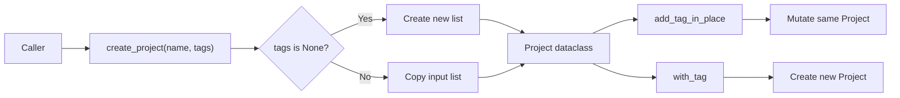

# M1-T03｜函数、类型注解与数据模型

你现在正处在一个很关键的转换点：M1-T02 故意使用裸 `dict`，让你真正碰到对象引用、浅拷贝和共享可变状态；M1-T03 开始解决它的另一个工程问题——**一个 Project 到底应该长什么样，现在只能靠人脑记忆。** 当前总结也明确把下一步定义为：参数、返回值、默认参数、`None`、类型注解、数据模型和 `dataclass`。

本节仍属于 Python 工程地基。**不进入 Pydantic、不进入 FastAPI、不讲复杂 OOP、不做 Service/Repository。**

---

## 1. 本节目标

附件对 M1 的要求不是重新刷 Python 语法，而是最终做到：能理解多文件工程、独立修改数据结构、写测试，并知道代码为什么这样组织。

完成 M1-T03 后，你至少应该能独立解释下面这些问题：

1. `name: str` 到底是什么意思，它会不会强制运行时只能传字符串？
2. `-> Project` 为什么值得写？
3. `list[str] | None` 和单纯的 `list[str]` 有什么区别？
4. 为什么函数参数不能随便写 `tags=[]`？
5. 为什么 `dataclass` 里的列表字段要使用 `field(default_factory=list)`？
6. 裸 `dict` 和 `dataclass` 分别适合什么场景？
7. 为什么从 `project["name"]` 改成 `project.name` 后，项目会更容易维护？
8. 为什么即使有了类型注解，我们以后仍然需要 Pydantic 做 HTTP 输入校验？

### 本卡验收结果

目标不是“学会 dataclass API”，而是完成这次工程演进：

```text
M1-T02

Project = 任意 dict
    ↓
M1-T03

Project = 明确的数据模型
函数 = 明确参数类型 + 返回类型
默认值 = 避免共享可变对象
测试 = 验证数据模型边界
```

---

# 2. 核心概念图解

## 2.1 先看当前问题

M1-T02 的 Project 当前大致是：

```python
{
    "name": name,
    "tags": [],
    "members": [],
}
```

这是之前**刻意保留**的学习型数据结构，用于观察引用、浅拷贝和可变对象。

它在当时是正确选择。

但现在假设出现：

```python
project = {
    "naem": "AI Workspace Lite",
    "tags": [],
    "members": [],
}
```

注意：

```text
naem
```

拼错了。

Python 不知道这是错的。

甚至：

```python
project = {
    "name": 123,
    "tags": "hello",
    "members": None,
}
```

从普通 `dict` 自身的角度看也完全合法。

于是业务代码必须到处“猜”：

```text
这里到底有没有 name？

name 是 str 吗？

tags 一定存在吗？

tags 是 list 吗？

members 会不会是 None？
```

工程越大，这种成本越高。

---

## 2.2 本节的数据流

先不要看代码，先看数据怎么流。

### 创建 Project

```text
调用者
  │
  │ name: str
  │ tags: list[str] | None
  ▼
create_project()
  │
  ├─ tags is None
  │      ↓
  │   创建新 []
  │
  └─ tags 有值
         ↓
      复制 list
  │
  ▼
Project(...)
  │
  ├─ name
  ├─ tags
  └─ members
  │
  ▼
返回 Project 对象
```

这里故意继续连接 M1-T02：

> 调用者传来的可变列表，不应该在没有明确意图时直接成为 Project 内部共享状态。

因此：

```python
tags=list(tags)
```

不是多余动作。

---

### 修改 Project

```text
Project
   │
   ├─────────────── add_tag_in_place()
   │                     │
   │                     └── 修改 project.tags
   │
   │                           原对象发生变化
   │
   └─────────────── with_tag()
                         │
                         ├── 复制 tags
                         ├── 添加 tag
                         └── 创建新的 Project

                              原对象不变化
```

M1-T02 学的是：

> **对象是否共享？**

M1-T03 开始进一步问：

> **函数有没有把这种行为从签名和数据模型中表达清楚？**

---

### Mermaid



---

# 3. 最小可行性代码

这次只动最必要的三个位置：

```text
/project
├── app/
│   ├── models.py             # 新增
│   └── project_state.py      # 修改
└── tests/
    └── test_project_state.py # 修改/新增测试
```

**不增加任何第三方依赖。**

`dataclass` 属于 Python 标准库。

---

## 3.1 新增 `app/models.py`

```python
# 新增：app/models.py

from dataclasses import dataclass, field


@dataclass
class Project:
    name: str
    tags: list[str] = field(default_factory=list)
    members: list[str] = field(default_factory=list)
```

先不要急着往里面塞十几个字段。

这一版只有三个职责明确的字段。

### 为什么不是这样？

```python
@dataclass
class Project:
    name: str
    tags: list[str] = []
```

不要这么写。

你在 M1-T02 已经学过：

```text
可变对象作为默认值
→ 多次创建之间可能共享状态
```

`dataclass` 因此要求这类字段使用：

```python
field(default_factory=list)
```

含义是：

```text
每创建一个 Project
        ↓
调用一次 list()
        ↓
得到属于自己的新列表
```

即：

```text
Project A.tags ──► list A

Project B.tags ──► list B
```

而不是：

```text
Project A.tags ──┐
                 ├──► 同一个 list
Project B.tags ──┘
```

---

## 3.2 修改 `create_project`

在 `app/project_state.py` 导入模型：

```python
# 修改：app/project_state.py

from app.models import Project
```

然后把原来的 `create_project()` 改成：

```python
# 修改：app/project_state.py

def create_project(
    name: str,
    tags: list[str] | None = None,
) -> Project:
    safe_tags = [] if tags is None else list(tags)

    return Project(
        name=name,
        tags=safe_tags,
    )
```

这里一次出现了本卡的四个核心知识点。

### ① 参数类型

```python
name: str
```

表达：

```text
这个函数设计上期待 name 是 str
```

---

### ② 可选值

```python
tags: list[str] | None
```

意思不是：

```text
tags 是 list，里面还能放 None
```

而是：

```text
tags 整个参数有两种可能

list[str]

或者

None
```

即：

```text
list[str] | None
```

---

### ③ 默认参数

```python
tags=None
```

调用者可以：

```python
create_project("Workspace")
```

也可以：

```python
create_project(
    "Workspace",
    ["python", "backend"],
)
```

---

### ④ 返回值类型

```python
-> Project
```

函数签名已经能告诉阅读者：

```text
输入：
    name
    tags

输出：
    Project
```

不用先进入函数内部阅读二十行代码。

这就是类型注解首先带来的工程价值：**提高代码可阅读性与工具可分析性。**

---

## 3.3 为什么还要 `list(tags)`？

注意这里：

```python
safe_tags = [] if tags is None else list(tags)
```

而不是：

```python
safe_tags = [] if tags is None else tags
```

假设：

```python
tags = ["python"]

project = create_project("demo", tags)

tags.append("docker")
```

如果 Project 直接保存原来的 `tags`：

```text
调用者 tags ──────┐
                   ├──► 同一个 list
Project.tags ─────┘
```

调用者这一句：

```python
tags.append("docker")
```

会偷偷改变 Project。

复制以后：

```text
调用者 tags ───► list A

Project.tags ───► list B
```

这就是 M1-T02 的知识开始进入实际设计。

---

## 3.4 修改 `add_tag_in_place`

```python
# 修改：app/project_state.py

def add_tag_in_place(
    project: Project,
    tag: str,
) -> None:
    project.tags.append(tag)
```

这里最值得看的是：

```python
-> None
```

它非常有信息量。

这个函数没有设计成：

```text
输入 Project
→ 返回新 Project
```

而是：

```text
输入 Project
→ 修改它
→ 不返回业务结果
```

所以：

```python
-> None
```

实际上帮助阅读代码的人理解了副作用。

---

## 3.5 修改 `with_tag`

继续保留 M1-T02 的“返回新对象”版本：

```python
# 修改：app/project_state.py

def with_tag(
    project: Project,
    tag: str,
) -> Project:
    return Project(
        name=project.name,
        tags=[*project.tags, tag],
        members=list(project.members),
    )
```

比较两个函数：

```python
add_tag_in_place(project, "python")
```

和：

```python
new_project = with_tag(project, "python")
```

现在它们的类型签名也表达了不同设计：

```python
def add_tag_in_place(...) -> None
```

vs.

```python
def with_tag(...) -> Project
```

这就是我希望你开始培养的习惯：

> **先看函数签名，大致就应该知道函数负责什么。**

---

## 3.6 修改 `clone_project`

```python
# 修改：app/project_state.py

def clone_project(project: Project) -> Project:
    return Project(
        name=project.name,
        tags=list(project.tags),
        members=list(project.members),
    )
```

我们这里仍然**不使用 `deepcopy()`**。

原因延续 M1-T02 的设计决定：目前 `tags` 和 `members` 的结构简单，可以明确复制需要隔离的可变字段。现有总结也已经记录，这是当前刻意采取的方案，而不是遗漏。

---

# 4. 项目集成指导

## 第一步：先创建数据模型

新增：

```text
app/models.py
```

只放：

```python
Project
```

不要顺手创造：

```text
User
Workspace
Task
File
OperationLog
```

现在没有这个需求。

---

## 第二步：让 `project_state.py` 使用 Project

以前：

```python
project["name"]
project["tags"]
project["members"]
```

现在：

```python
project.name
project.tags
project.members
```

这一变化非常重要。

以前：

```python
project["does_not_exist"]
```

只能运行到这里以后才暴露问题。

现在 IDE / 类型工具至少已经知道：

```text
Project 有哪些字段
```

---

## 第三步：更新原有测试

你原来已经有 6 个 Project 状态专项测试，其中覆盖共享引用、原地修改、新对象、浅拷贝和克隆隔离。

**不要把它们全删掉重新写。**

只修改因 Project 表示方式变化而必须变化的部分。

例如以前可能是：

```python
assert project["name"] == "demo"
```

现在改成：

```python
# 修改

assert project.name == "demo"
```

以前：

```python
project["tags"].append("python")
```

改成：

```python
# 修改

project.tags.append("python")
```

---

## 第四步：不要丢掉浅拷贝实验

原来的 M1-T02 有一个重要测试：

> `dict.copy()` 只做浅拷贝，嵌套的 `members` 仍然可能共享。

Project 已经不再是 dict 后，不要为了让测试通过把这个知识点删掉。

可以把实验对象改成测试里的局部 dict：

```python
# 修改：保留 M1-T02 的浅拷贝实验

def test_shallow_copy_still_shares_nested_mutable_object() -> None:
    original = {
        "members": [],
    }

    copied = original.copy()

    copied["members"].append("alice")

    assert original["members"] == ["alice"]
```

注意：

这个测试现在是在验证：

```text
Python dict.copy() 语义
```

而不是验证：

```text
Project API
```

把两个概念拆开，反而更清楚。

---

## 第五步：增加数据模型测试

至少增加：

```python
# 新增：tests/test_project_state.py

from app.models import Project
from app.project_state import create_project


def test_create_project_returns_project() -> None:
    project = create_project("demo")

    assert isinstance(project, Project)
    assert project.name == "demo"


def test_projects_do_not_share_default_lists() -> None:
    first = Project(name="first")
    second = Project(name="second")

    first.tags.append("python")

    assert first.tags == ["python"]
    assert second.tags == []


def test_create_project_copies_input_tags() -> None:
    tags = ["python"]

    project = create_project("demo", tags)

    tags.append("docker")

    assert tags == ["python", "docker"]
    assert project.tags == ["python"]
```

第三个测试尤其重要。

它不是为了凑测试数量。

它是在验证我们的设计承诺：

```text
外部传入列表
≠
Project 内部列表
```

---

## 第六步：运行验证

项目当前已经有虚拟环境，并且此前验证过：

```bash
.venv/bin/python -m pytest
```

可以运行。

这次完成代码修改后执行：

```bash
.venv/bin/python -m pytest -v
```

然后：

```bash
.venv/bin/python -m app.main
```

最后必须看：

```bash
git diff
```

不要只看到：

```text
passed
```

就结束。

M1-T02 已经真的发生过“测试绿了，但业务代码其实有问题”和“测试因为命名错误根本没被收集”的情况。

所以检查三件事：

```text
测试逻辑正确？
        +
预期测试被 collected？
        +
全量回归通过？
```

---

# 5. 避坑指南

## 坑 1：以为类型注解会自动拦截错误输入

这是非常重要的一点：

```python
def create_project(name: str) -> Project:
    ...
```

**不是运行时输入校验。**

Python 类型注解主要是：

```text
给开发者看
+
给 IDE 看
+
给静态类型检查工具看
```

例如普通 Python 下：

```python
Project(name=123)
```

`dataclass` 本身不会因为你写了：

```python
name: str
```

就自动把它拒绝。

后面 M2 的 Pydantic 才会专门解决：

```text
HTTP 请求进来了
→ 输入是否合法？
→ 能否转型？
→ 不合法如何返回错误？
```

所以不要提前把：

```text
Type Hint
```

误解成：

```text
Runtime Validation
```

---

## 坑 2：又写出可变默认参数

函数：

```python
def create_project(tags=[]):
```

不行。

数据模型也不要：

```python
tags = []
```

你现在看到：

```python
None
```

以及：

```python
field(default_factory=list)
```

本质上都在解决同一类问题：

> **不要无意中让多个对象/调用共享一个本应独立的可变对象。**

---

## 坑 3：有 dataclass 以后疯狂加方法

不要把：

```python
Project
```

马上写成：

```text
Project
├── create
├── delete
├── save
├── load
├── clone
├── send_email
├── connect_database
├── generate_report
└── call_llm
```

现在 `Project` 的主要任务只有：

> **表达 Project 数据长什么样。**

“哪个模块负责什么”是 **M1-T04** 的主题。

我们不抢跑。

---

## 坑 4：为了类型注解马上装 mypy、pyright 等工具

暂时不用。

本项目当前运行时第三方依赖还是空的，开发依赖只有 pytest。

先做到：

```text
你自己会写合理的类型
↓
你自己会阅读函数签名
↓
你自己能判断 None 是否合理
```

后面再谈静态检查工具。

不要再次变成：

```text
工具装了一堆
基础概念还没掌握
```

---

## 坑 5：把 `Any` 当逃生通道

例如：

```python
def create_project(name: Any) -> Any:
```

基本等于没写。

如果你发现自己大量使用：

```python
Any
```

先问：

> 是业务真的允许任意类型，还是我自己还没想清楚数据结构？

大多数 M1 阶段的情况是后者。

---

## 坑 6：为了迁移 dataclass 删除原来的行为测试

不能这么干。

重构后：

```text
实现方式可以变化
```

但：

```text
已经确认的重要行为
```

应该尽量保留测试。

例如 M1-T02 已经确认：

```text
add_tag_in_place 会修改原对象
with_tag 不应修改原对象
不同 Project 不共享可变字段
clone 后可变字段隔离
```

这些仍然应该成立。

---

# 6. 🚨 独立验收任务

下面开始是你的 **无 AI 时间**。

**请关闭对话框后再做。**

我不给这部分答案代码。

---

### 任务 A：独立增加一个可选字段

给 `Project` 增加：

```text
description
```

要求：

```text
类型：
str | None

默认值：
None
```

然后让下面两种调用都成立：

```python
create_project("demo")
```

以及：

```python
create_project(
    "demo",
    description="backend learning project",
)
```

你需要自己判断：

```text
Project 怎么改？
create_project 参数怎么改？
返回对象怎么改？
哪些测试应该增加？
```

至少测试：

```text
不传 description
→ description is None

传 description
→ 正确保留字符串
```

---

### 任务 B：独立解释，不准只给结论

完成后，用自己的话写出下面四题的答案：

**1.**

为什么：

```python
tags: list[str] = []
```

存在风险，而：

```python
field(default_factory=list)
```

更合适？

**2.**

为什么：

```python
name: str
```

不等价于运行时输入校验？

**3.**

下面两个返回类型分别暴露了什么设计意图？

```python
def add_tag_in_place(...) -> None
```

```python
def with_tag(...) -> Project
```

**4.**

为什么 `create_project()` 收到调用者传来的 `tags` 后，我们选择复制一次？

---

### 任务 C：完整验证

独立运行：

```bash
.venv/bin/python -m pytest -v
```

确认：

```text
0 failed
```

并检查收集到的测试数量是否符合你的预期。

然后：

```bash
git diff
```

自己逐文件阅读修改。

---

## 完成后怎么回复我

把下面四项贴回来即可：

```text
1. git diff

2. pytest 最终结果

3. 本次新增/修改了哪些文件

4. 上面四道解释题的答案
```

我下一轮会按 **Code Reviewer** 模式审查，不只看“能不能跑”，还会重点找：

```text
共享可变状态
类型设计失真
None 处理错误
无效类型注解
测试没有真正验证行为
回归测试丢失
API 语义变化
```

审核通过后，还没有结束。

你还必须新增：

```text
learning_records/M1-T03.md
```

并增量更新：

```text
summary.md
```

记录至少包括：

```text
完成内容
代码变更
验证命令
实际验证结果
Code Review 结果
遗留问题
下一步
```

**记录文件未写入，M1-T03 不正式收口。** 这也符合当前项目已经建立的任务记录机制和增量维护规则。

---

# 7. 官方参考锚点

这次只看三个官方入口，不需要往外扩。

**Python `dataclasses` 官方文档**

[https://docs.python.org/3/library/dataclasses.html](https://docs.python.org/3/library/dataclasses.html)

重点查：

```text
@dataclass
field()
default_factory
```

**Python `typing` 官方文档**

[https://docs.python.org/3/library/typing.html](https://docs.python.org/3/library/typing.html)

现阶段只需要知道它在 Python 类型系统中的位置，不必通读。

**Python 官方教程：Defining Functions**

[https://docs.python.org/3/tutorial/controlflow.html#defining-functions](https://docs.python.org/3/tutorial/controlflow.html#defining-functions)

重点回看：

```text
函数参数
默认参数
返回值
可变默认参数
```

附件本身也把“函数、类型注解、数据模型”和 `dataclass` 放在 M1-T03，而复杂的类、组合与模块职责留到下一张 M1-T04。

**现在不要开始 M1-T04。先把 M1-T03 的独立验收做完。**
